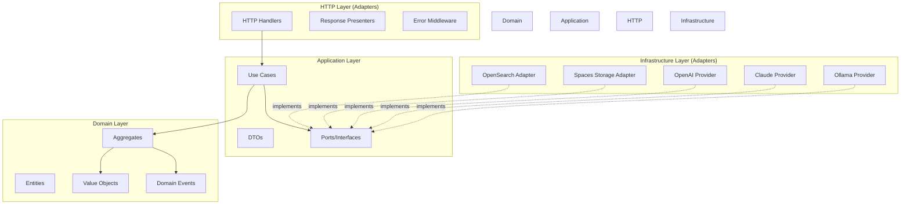
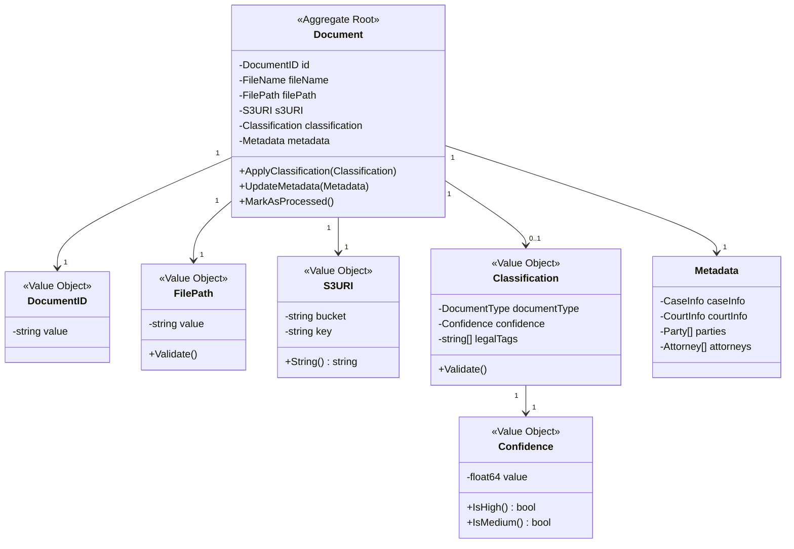
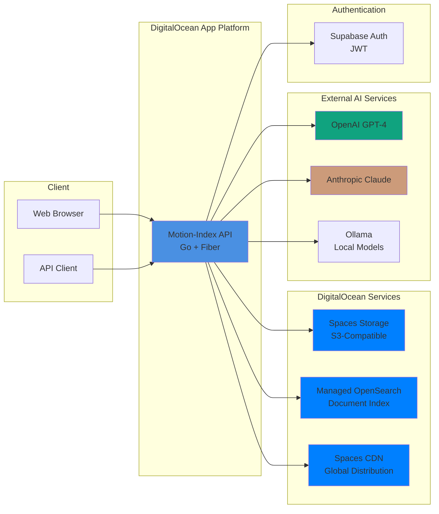

# Phase 7: Documentation & Testing

## Overview

Complete comprehensive documentation and achieve >80% test coverage. Create Architecture Decision Records (ADRs), architecture diagrams, migration guide, API documentation, and performance benchmarks.

## Objectives

- [ ] Create 4 Architecture Decision Records (ADRs)
- [ ] Create architecture diagrams (hexagonal, domain model, deployment)
- [ ] Write comprehensive migration guide
- [ ] Achieve >80% overall test coverage
- [ ] Write performance benchmarks
- [ ] Create API documentation (OpenAPI/Swagger)
- [ ] Document deployment procedures
- [ ] Create developer onboarding guide

## Prerequisites

- **Phases 1-6 Complete**: All implementation phases finished
- PlantUML or Mermaid knowledge (for diagrams)
- Benchmark testing knowledge
- Test coverage tools (go test -cover)

## Current State

**Documentation**:
- Basic README.md
- CLAUDE.md with general guidance
- No ADRs
- No architecture diagrams
- No migration guide
- Incomplete API documentation

**Test Coverage**: ~18.8%
- Mostly infrastructure tests
- Few domain/application tests
- No benchmark tests

## Target State

**Documentation**:
- 4+ ADRs documenting key decisions
- Architecture diagrams (3+ diagrams)
- Comprehensive migration guide
- Complete API documentation (OpenAPI 3.0)
- Deployment guide
- Developer onboarding guide

**Test Coverage**: >80%
- Domain: 100%
- Application: >90%
- Infrastructure: >70%
- Overall: >80%

## Task Breakdown

### Task Group 1: Architecture Decision Records (ADRs)

#### Task 1.1: ADR Template
**File**: `docs/architecture/adr/template.md`

```markdown
# ADR-XXX: [Title]

## Status
[Proposed | Accepted | Deprecated | Superseded]

## Context
What is the issue we're facing? What factors are in play?

## Decision
What is the change that we're proposing/making?

## Consequences
What are the positive and negative consequences of this decision?

## Alternatives Considered
What other options were considered?

## References
Links to supporting materials, discussions, or related ADRs.

---
**Date**: YYYY-MM-DD
**Author**: [Name]
**Reviewers**: [Names]
```

---

#### Task 1.2: ADR-001 Hexagonal Architecture
**File**: `docs/architecture/adr/001-hexagonal-architecture.md`

```markdown
# ADR-001: Adopt Hexagonal Architecture (Ports & Adapters)

## Status
Accepted

## Context
The current Motion-Index-Fiber architecture has significant coupling issues:
- Business logic is embedded in HTTP handlers (4,180 LOC)
- Direct dependencies on external services (OpenSearch, Spaces, AI providers)
- Hard to test without mocking infrastructure
- Cannot easily swap implementations (e.g., switch from OpenAI to Claude)
- Difficult to add new features without touching multiple layers

We need an architecture that:
- Separates business logic from infrastructure
- Allows easy testing of domain logic
- Enables swapping implementations without changing business logic
- Provides clear boundaries between layers

## Decision
We will adopt **Hexagonal Architecture** (also known as Ports & Adapters) with the following structure:

```
┌─────────────────────────────────────────┐
│           HTTP Layer                    │
│       (Handlers, Presenters)            │
└──────────────┬──────────────────────────┘
               │
┌──────────────▼──────────────────────────┐
│        Application Layer                │
│    (Use Cases, DTOs, Ports)             │
└──────────────┬──────────────────────────┘
               │
┌──────────────▼──────────────────────────┐
│          Domain Layer                   │
│  (Aggregates, Entities, Value Objects)  │
└─────────────────────────────────────────┘
               ▲
┌──────────────┴──────────────────────────┐
│      Infrastructure Layer               │
│ (Adapters: OpenSearch, Spaces, AI)     │
└─────────────────────────────────────────┘
```

**Layers**:
1. **Domain**: Pure business logic, no external dependencies
2. **Application**: Use cases orchestrating domain objects, depends on ports
3. **Infrastructure**: Adapters implementing ports, depends on external services
4. **HTTP**: Thin handlers, depends on application layer

**Dependency Rule**: Dependencies point inward. Infrastructure depends on Application/Domain, not vice versa.

## Consequences

### Positive
- **Testability**: Domain and application logic can be tested without infrastructure
- **Flexibility**: Easy to swap implementations (e.g., change AI provider)
- **Maintainability**: Clear separation of concerns, easier to understand
- **Scalability**: Can add new features without touching existing layers
- **Team Velocity**: Developers can work on different layers independently

### Negative
- **Initial Complexity**: More files and abstractions
- **Learning Curve**: Team needs to understand hexagonal architecture
- **Migration Effort**: Significant refactoring required (~8 phases)
- **Indirection**: More layers means more navigation

## Alternatives Considered

### 1. Keep Current Architecture
**Pros**: No migration effort
**Cons**: Coupling issues remain, hard to maintain/test

### 2. Clean Architecture (Uncle Bob)
**Pros**: Similar benefits to hexagonal
**Cons**: More complex (4+ layers), overkill for our needs

### 3. Layered Architecture
**Pros**: Simpler than hexagonal
**Cons**: Still allows dependencies from business logic to infrastructure

## References
- [Hexagonal Architecture by Alistair Cockburn](https://alistair.cockburn.us/hexagonal-architecture/)
- [Ports & Adapters Pattern](https://herbertograca.com/2017/11/16/explicit-architecture-01-ddd-hexagonal-onion-clean-cqrs-how-i-put-it-all-together/)
- Netflix Tech Blog: [Ready for changes with Hexagonal Architecture](https://netflixtechblog.com/ready-for-changes-with-hexagonal-architecture-b315ec967749)

---
**Date**: 2025-10-27
**Author**: Motion-Index Team
**Status**: Accepted
```

---

#### Task 1.3: ADR-002 Domain-Driven Design
**File**: `docs/architecture/adr/002-domain-driven-design.md`

```markdown
# ADR-002: Apply Domain-Driven Design (DDD)

## Status
Accepted

## Context
Our current domain models are anemic - mostly data structures with getters/setters and no business logic. Business rules are scattered across handlers, services, and utilities.

Problems:
- Hard to find where business rules are enforced
- Easy to violate invariants (e.g., negative confidence scores)
- No clear domain language
- Difficult to understand business requirements from code

## Decision
We will apply **Domain-Driven Design** principles:

### Aggregates
- **Document** aggregate: Root entity managing document lifecycle
- **Legal** aggregate: Case, party, attorney entities

### Value Objects
- **FilePath**, **S3URI**, **Hash**, **Confidence**: Type-safe wrappers
- Immutable, validated on construction
- No primitive obsession

### Domain Services
- **Classifier**: Classification logic
- **EventPublisher**: Domain event publishing

### Domain Events
- **DocumentCreated**, **DocumentClassified**, **MetadataUpdated**
- Enable event-driven architecture
- Decouple side effects

### Ubiquitous Language
Use legal terminology consistently:
- Motion, Brief, Order, Minute Order
- Plaintiff, Defendant, Attorney, Judge
- Filing Date, Hearing Date, Decision Date

## Consequences

### Positive
- **Business Logic Centralized**: All rules in domain layer
- **Type Safety**: Value objects prevent invalid states
- **Expressiveness**: Code reads like business requirements
- **Testability**: Pure domain logic, easy to test
- **Maintainability**: Changes to business rules in one place

### Negative
- **More Classes**: Value objects increase file count
- **Boilerplate**: Validation in constructors
- **Learning Curve**: Team needs DDD knowledge

## Alternatives Considered

### 1. Anemic Domain Model
**Pros**: Simple, minimal code
**Cons**: Business logic scattered, hard to maintain

### 2. Transaction Script
**Pros**: Straightforward, easy to understand
**Cons**: Doesn't scale, duplicated logic

## References
- [Domain-Driven Design by Eric Evans](https://www.domainlanguage.com/ddd/)
- [Implementing DDD by Vaughn Vernon](https://vaughnvernon.com/books/)
- [DDD Aggregates](https://martinfowler.com/bliki/DDD_Aggregate.html)

---
**Date**: 2025-10-27
**Author**: Motion-Index Team
**Status**: Accepted
```

---

#### Task 1.4: ADR-003 AI Provider Plugin System
**File**: `docs/architecture/adr/003-ai-provider-plugin-system.md`

```markdown
# ADR-003: AI Provider Plugin System with Fallback

## Status
Accepted

## Context
Currently, AI classification is hard-coded to specific providers (OpenAI, Claude, Ollama). Adding a new provider requires modifying multiple files. No fallback mechanism if primary provider fails.

Requirements:
- Support multiple AI providers (OpenAI, Claude, Ollama, future providers)
- Easy to add new providers
- Fallback to alternative providers if primary fails
- Consistent classification across providers

## Decision
Implement a **plugin system** with **fallback strategy**:

### Plugin Interface
```go
type Classifier interface {
    Classify(ctx context.Context, text string, metadata map[string]string) (*ClassificationResult, error)
    GetSupportedCategories() []string
    GetProviderName() string
    IsConfigured() bool
}
```

### Provider Registry
```go
type AIProviderRegistry struct {
    providers map[string]Classifier
}

func (r *AIProviderRegistry) Register(name string, provider Classifier)
func (r *AIProviderRegistry) Get(name string) (Classifier, error)
```

### Fallback Strategy
```go
type FallbackClassifier struct {
    primary   Classifier
    fallbacks []Classifier
}

func (f *FallbackClassifier) Classify(...) (*ClassificationResult, error) {
    // Try primary
    result, err := f.primary.Classify(...)
    if err == nil {
        return result, nil
    }

    // Try fallbacks in order
    for _, fallback := range f.fallbacks {
        result, err = fallback.Classify(...)
        if err == nil {
            return result, nil
        }
    }

    return nil, errors.New("all providers failed")
}
```

### Configuration
```yaml
ai:
  primary_provider: "openai"
  fallback_providers: ["claude", "ollama"]

  openai:
    enabled: true
    api_key: "..."
    model: "gpt-4"

  claude:
    enabled: true
    api_key: "..."
    model: "claude-3-sonnet"

  ollama:
    enabled: true
    base_url: "http://localhost:11434"
    model: "llama3"
```

## Consequences

### Positive
- **Extensibility**: Add new providers without modifying existing code (OCP)
- **Resilience**: Fallback if primary provider fails
- **Flexibility**: Easy to switch providers via configuration
- **Testability**: Mock providers for testing
- **Vendor Independence**: Not locked to single provider

### Negative
- **Complexity**: More abstraction layers
- **Latency**: Fallback adds latency on failure
- **Cost**: May use multiple providers (if fallback needed)

## Alternatives Considered

### 1. Hard-coded Providers
**Pros**: Simple, no abstraction
**Cons**: Hard to extend, no fallback

### 2. Single Provider
**Pros**: Minimal complexity
**Cons**: Single point of failure

### 3. Load Balancing
**Pros**: Distribute load across providers
**Cons**: More complex, may need rate limiting

## References
- [Plugin Architecture Pattern](https://en.wikipedia.org/wiki/Plug-in_(computing))
- [Chain of Responsibility Pattern](https://refactoring.guru/design-patterns/chain-of-responsibility)

---
**Date**: 2025-10-27
**Author**: Motion-Index Team
**Status**: Accepted
```

---

#### Task 1.5: ADR-004 Compile-Time Dependency Injection
**File**: `docs/architecture/adr/004-compile-time-dependency-injection.md`

```markdown
# ADR-004: Compile-Time Dependency Injection with Wire

## Status
Accepted

## Context
Current dependency wiring is manual (~242 LOC in main.go). Adding a new dependency requires updating multiple files. No compile-time validation of dependency graph.

Issues:
- Error-prone (easy to forget dependencies)
- Boilerplate code
- No compile-time safety
- Hard to maintain

## Decision
Use **Google Wire** for compile-time dependency injection.

### Provider Functions
```go
func ProvideDocumentRepository(cfg *cloud.Config) (ports.DocumentRepository, error)
func ProvideStorageService(cfg *cloud.Config) (ports.StorageService, error)
```

### Injection Sets
```go
var InfrastructureSet = wire.NewSet(
    ProvideDocumentRepository,
    ProvideStorageService,
    ProvideSearchService,
)
```

### Wire Injector
```go
//go:build wireinject

func InitializeApplication() (*Application, func(), error) {
    wire.Build(
        ConfigSet,
        InfrastructureSet,
        ApplicationSet,
        HTTPSet,
    )
    return nil, nil, nil
}
```

### Generated Code
Wire generates `wire_gen.go` with all wiring logic at compile time.

## Consequences

### Positive
- **Compile-Time Safety**: Missing dependencies = compile error
- **Less Boilerplate**: ~242 LOC → ~15 LOC in main.go
- **Maintainability**: Single source of truth for dependencies
- **Graph Validation**: Wire validates entire dependency graph

### Negative
- **Build Step**: Must run `wire` before building
- **Learning Curve**: Team needs to understand Wire
- **Generated Code**: wire_gen.go added to version control

## Alternatives Considered

### 1. Manual Wiring
**Pros**: No external tools
**Cons**: Error-prone, boilerplate

### 2. Runtime DI (dig, fx)
**Pros**: Flexible, runtime configuration
**Cons**: Errors only at runtime, reflection overhead

### 3. Constructor Injection
**Pros**: Simple, explicit
**Cons**: Boilerplate, no graph validation

## References
- [Google Wire](https://github.com/google/wire)
- [Wire User Guide](https://github.com/google/wire/blob/main/docs/guide.md)

---
**Date**: 2025-10-27
**Author**: Motion-Index Team
**Status**: Accepted
```

---

### Task Group 2: Architecture Diagrams

#### Task 2.1: Hexagonal Architecture Diagram
**File**: `docs/architecture/diagrams/hexagonal-architecture.md`



---

#### Task 2.2: Domain Model Diagram
**File**: `docs/architecture/diagrams/domain-model.md`



---

#### Task 2.3: Deployment Architecture
**File**: `docs/architecture/diagrams/deployment.md`



---

### Task Group 3: Migration Guide

#### Task 3.1: Migration Guide
**File**: `docs/migration/migration-guide.md`

```markdown
# Migration Guide: SOLID Architecture Redesign

## Overview
This guide walks through migrating the Motion-Index-Fiber API from transaction script architecture to hexagonal architecture with DDD.

## Migration Phases

### Phase 1: Domain Layer ✅
**Status**: Complete
**Files Created**: 17 files, ~4,200 LOC
**Key Changes**:
- Created domain aggregates (Document, Legal)
- Implemented value objects (FilePath, S3URI, Confidence)
- Added domain events
- Defined repository interfaces

**Validation**:
```bash
go test ./internal/domain/... -v -cover
# Expected: 100% coverage
```

### Phase 2: Application Layer ✅
**Status**: Complete
**Files Created**: 20 files, ~4,200 LOC
**Key Changes**:
- Defined application ports
- Created DTOs for all operations
- Implemented 8 use cases
- Added validation layer

**Validation**:
```bash
go test ./internal/application/... -v -cover
# Expected: >90% coverage
```

... (continue for all phases)

## Breaking Changes

### API Changes
None - API contract remains the same

### Configuration Changes
New configuration structure:
```bash
# Old
OPENSEARCH_HOST=...

# New
DO_OPENSEARCH_HOST=...
DO_OPENSEARCH_PORT=25060
```

### Environment Variables
See `.env.example` for complete list.

## Rollback Procedure

If issues arise:
1. Revert to previous version: `git revert <commit>`
2. Redeploy: `git push origin main`
3. Monitor logs: `doctl apps logs <app-id>`

## Testing Checklist

- [ ] All unit tests passing
- [ ] All integration tests passing
- [ ] Manual smoke tests completed
- [ ] Performance benchmarks met
- [ ] No regressions detected

## Deployment

### Development
```bash
make wire
make build
./bin/server
```

### Production
```bash
git push origin main
# DigitalOcean App Platform auto-deploys
```

## Support

If issues arise:
- Check logs: `doctl apps logs <app-id>`
- Review ADRs: `docs/architecture/adr/`
- Contact team lead
```

---

### Task Group 4: Test Coverage

#### Task 4.1: Coverage Scripts
**File**: `scripts/coverage.sh`

```bash
#!/bin/bash

# Generate coverage report
echo "Running tests with coverage..."
go test ./... -v -coverprofile=coverage.out -covermode=atomic

# Generate HTML report
go tool cover -html=coverage.out -o coverage.html

# Extract coverage percentage
COVERAGE=$(go tool cover -func=coverage.out | grep total | awk '{print $3}')

echo "Total Coverage: $COVERAGE"

# Check if coverage meets threshold
THRESHOLD=80.0
COVERAGE_NUM=$(echo $COVERAGE | sed 's/%//')

if (( $(echo "$COVERAGE_NUM < $THRESHOLD" | bc -l) )); then
    echo "ERROR: Coverage $COVERAGE is below threshold $THRESHOLD%"
    exit 1
else
    echo "SUCCESS: Coverage $COVERAGE meets threshold $THRESHOLD%"
fi
```

---

#### Task 4.2: Coverage by Package
**File**: `scripts/coverage-by-package.sh`

```bash
#!/bin/bash

echo "Coverage by package:"
echo "===================="

# Domain layer
echo "Domain Layer:"
go test ./internal/domain/... -cover | grep coverage

# Application layer
echo -e "\nApplication Layer:"
go test ./internal/application/... -cover | grep coverage

# Infrastructure layer
echo -e "\nInfrastructure Layer:"
go test ./internal/infrastructure/... -cover | grep coverage

# Overall
echo -e "\nOverall:"
go test ./... -cover | grep coverage
```

---

### Task Group 5: Performance Benchmarks

#### Task 5.1: Benchmark Suite
**File**: `internal/benchmarks/document_benchmark_test.go`

```go
package benchmarks

import (
    "context"
    "testing"

    "motion-index-fiber/internal/domain/document"
)

func BenchmarkDocumentCreation(b *testing.B) {
    b.ReportAllocs()
    for i := 0; i < b.N; i++ {
        _, err := document.NewDocument(
            document.WithID("doc_123"),
            document.WithFileName("test.pdf"),
        )
        if err != nil {
            b.Fatal(err)
        }
    }
}

func BenchmarkClassificationApplication(b *testing.B) {
    doc, _ := document.NewDocument(
        document.WithID("doc_123"),
        document.WithFileName("test.pdf"),
        document.WithText("Motion to suppress evidence"),
    )

    classification := &document.Classification{
        DocumentType: "Motion",
        Confidence:   0.95,
    }

    b.ResetTimer()
    b.ReportAllocs()
    for i := 0; i < b.N; i++ {
        _ = doc.ApplyClassification(classification)
    }
}

func BenchmarkRepositorySave(b *testing.B) {
    // Benchmark repository operations
}
```

---

### Task Group 6: API Documentation

#### Task 6.1: OpenAPI Specification
**File**: `docs/api/openapi.yaml`

```yaml
openapi: 3.0.0
info:
  title: Motion-Index-Fiber API
  description: Legal document processing API for California public defenders
  version: 1.0.0
  contact:
    name: Motion-Index Team

servers:
  - url: https://api.motion-index.com
    description: Production server
  - url: http://localhost:8003
    description: Development server

paths:
  /api/v1/documents:
    post:
      summary: Process a document
      description: Upload and process a legal document
      operationId: processDocument
      requestBody:
        required: true
        content:
          multipart/form-data:
            schema:
              type: object
              properties:
                file:
                  type: string
                  format: binary
                id:
                  type: string
                extract_text:
                  type: boolean
                classify:
                  type: boolean
      responses:
        '200':
          description: Document processed successfully
          content:
            application/json:
              schema:
                $ref: '#/components/schemas/DocumentResponse'
        '400':
          description: Invalid request
          content:
            application/json:
              schema:
                $ref: '#/components/schemas/ErrorResponse'

components:
  schemas:
    DocumentResponse:
      type: object
      properties:
        success:
          type: boolean
        data:
          type: object
          properties:
            id:
              type: string
            file_name:
              type: string
            document_type:
              type: string
            confidence:
              type: number
              format: float

    ErrorResponse:
      type: object
      properties:
        success:
          type: boolean
        error:
          type: object
          properties:
            code:
              type: string
            message:
              type: string
```

---

## Files to Create

| File | Purpose | LOC |
|------|---------|-----|
| `docs/architecture/adr/template.md` | ADR template | ~50 |
| `docs/architecture/adr/001-hexagonal-architecture.md` | ADR 1 | ~200 |
| `docs/architecture/adr/002-domain-driven-design.md` | ADR 2 | ~180 |
| `docs/architecture/adr/003-ai-provider-plugin-system.md` | ADR 3 | ~200 |
| `docs/architecture/adr/004-compile-time-di.md` | ADR 4 | ~150 |
| `docs/architecture/diagrams/hexagonal-architecture.md` | Diagram 1 | ~100 |
| `docs/architecture/diagrams/domain-model.md` | Diagram 2 | ~150 |
| `docs/architecture/diagrams/deployment.md` | Diagram 3 | ~100 |
| `docs/migration/migration-guide.md` | Migration guide | ~800 |
| `docs/api/openapi.yaml` | API spec | ~600 |
| `scripts/coverage.sh` | Coverage script | ~50 |
| `scripts/coverage-by-package.sh` | Package coverage | ~40 |
| `internal/benchmarks/document_benchmark_test.go` | Benchmarks | ~150 |

**Total**: ~13 files, ~2,770 LOC

---

## Testing Strategy

### Coverage Goals
- **Domain Layer**: 100% coverage
- **Application Layer**: >90% coverage
- **Infrastructure Layer**: >70% coverage
- **Overall**: >80% coverage

### Test Types
1. **Unit Tests**: All packages
2. **Integration Tests**: End-to-end flows
3. **Benchmark Tests**: Performance validation
4. **Contract Tests**: API compatibility

### Coverage Tracking
```bash
# Run all tests with coverage
make test-coverage

# View coverage report
open coverage.html

# Check coverage by package
make coverage-by-package
```

---

## Acceptance Criteria

- [ ] 4+ ADRs created documenting key decisions
- [ ] 3+ architecture diagrams created
- [ ] Migration guide written
- [ ] >80% overall test coverage achieved
- [ ] Performance benchmarks written
- [ ] OpenAPI specification created
- [ ] All documentation reviewed and approved

---

## Success Metrics

- Test coverage: >80%
- Documentation completeness: 100%
- ADRs: 4+
- Diagrams: 3+
- Benchmark tests: 10+

---

## Dependencies

- Phases 1-6 complete (implementation done)
- Mermaid or PlantUML for diagrams
- OpenAPI tooling

---

**Phase Status**: ⚪ Not Started
**Dependencies**: Phases 1-6 complete
**Next Phase**: Phase 8 (Migration & Cleanup)
